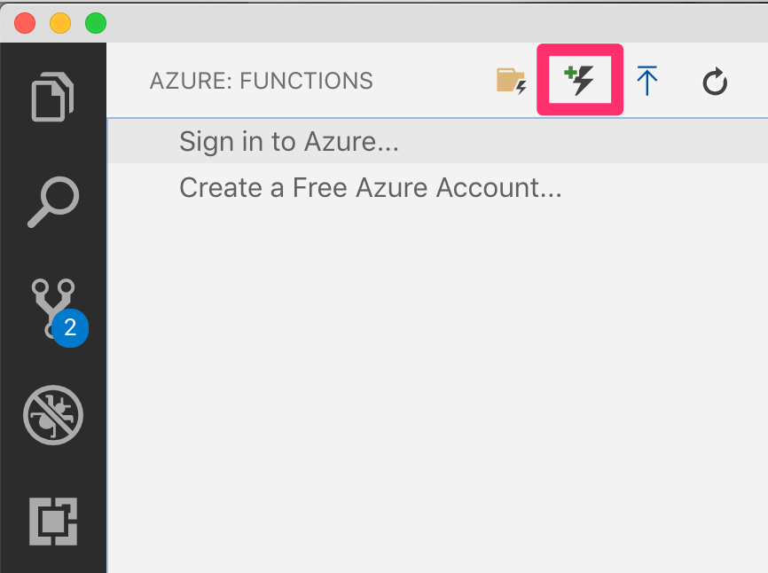
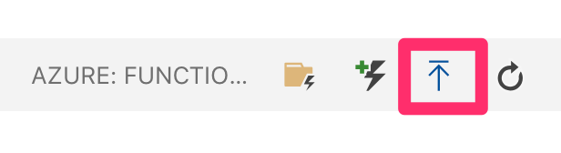

# Azure Function Web API secured by Azure AD

This code example demonstrates how to secure an Azure function with Azure AD when the function uses HTTPTrigger and exposes a Web API. The Web API is written using python, and leverages the WSGI model.

This readme walks you through the steps of setting up such a function from scratch. While you can develop Azure functions in many ways, such as Visual Studio 2019, Visual Studio Code, etc. this guide shows how to perform the steps using Visual Studio Code.

## Prerequisites
1. You must have Visual Studio Code installed
2. You must have Azure Functions core tools installed `npm install -g azure-functions-core-tools`
3. Azure functions VSCode extension (https://marketplace.visualstudio.com/items?itemName=ms-azuretools.vscode-azurefunctions)

There are two main parts here,

a) Writing the project and get things running locally
b) Deploy to an Azure subscription.

But before we do either of these, we will need an AAD app that will act as the function Web API registration.

## Register an AAD App

The Azure function acts as a WebAPI. 

Register a new app, with the following redirect URIs,
For local testing - 
```
  http://localhost:3000/callback
  http://localhost:3000
```

For testing in Azure (this must match your Azure functions URL which you will create later in this tutorial) - 
```
  https://<yournodejsfunction>.azurewebsites.net/callback
  https://<yournodejsfunction>.azurewebsites.net
```
Note down it's application id. I will refer to this application id as `client_id_api` for the purposes of this document.

Also choose to generate a client secret - save it somewhere, you'll need it soon.

Also save the app id URI of this app.

## Author the project

1. First create a new project `func init SecureAPI`, choose to `python` as the platform you are targeting
2. Next open this folder in VSCode, and choose to add a new function as shown below.
 
  
 Name the function `bootstrapFunction`
 This will ask you to initialize the project for use with VSCode, choose Yes.
3. Next, create a requirements.txt in your functions project and add the following
``` 
flask
python-dotenv
python-jose-cryptodome
flask-cors
six
azf-wsgi
```
4. The purpose of the bootstrap function is to bootstrap a flask app. In the __init__.py file of the bootstrap function, put the following code.
``` python
import sys
import logging
import azure.functions as func

from azf_wsgi import AzureFunctionsWsgi

sys.path.insert(0,"./secureFlaskApp/")
from secureFlaskApp import app as application

def main(req: func.HttpRequest) -> func.HttpResponse:
    logging.info('Python HTTP trigger function processed a request.')
    return AzureFunctionsWsgi(application).main(req)
```

5. Modify the function.json of the bootstrapFunction to as below,
``` JSON
{
  "scriptFile": "__init__.py",
  "bindings": [
    {
      "authLevel": "anonymous",
      "type": "httpTrigger",
      "direction": "in",
      "name": "req",
      "methods": [
        "get",
        "post"
      ],
      "route": "{*route}"
    },
    {
      "type": "http",
      "direction": "out",
      "name": "$return"
    }
  ]
}
```
6. In the "SecureAPI" function folder, add a new folder called `secureFlaskApp` with two files in it `secureFlaskApp.wsgi`, and `__init__.py`
7. In `secureFlaskApp.wsgi` add the following code, 
``` Python
import sys
sys.path.insert(0,"./secureFlaskApp/")
from secureFlaskApp import app as application
```
8. In `secureFlaskApp\__init__.py` is where your actual flask app goes. Copy the code from the provided code sample, and remember to modify lines 23, 24 with your function App App URI, and tenant ID
```
API_AUDIENCE = "<appiduri>"
TENANT_ID = "<tenantid>"
```

9. All done, lets test it!

 ## Test your function - locally

 1. With the project open in VSCode, just hit F5, or you can also run `func host start` from the CLI.
 2. You will need an access token to call this function. In order to get the access token, open browser in private mode and visit
 ```
 https://login.microsoftonline.com/<tenant_name>.onmicrosoft.com/oauth2/v2.0/authorize?response_type=code&client_id=<client_id_api>&redirect_uri=https://localhost:3000/callback&scope=openid
```

This will prompt you to perform authentication, and it will return a code. 
Use that code in the following request to get an access token, remember to put in the code and client secret.

```
curl -X POST \
  https://login.microsoftonline.com/<tenant_name>.onmicrosoft.com/oauth2/v2.0/token \
  -H 'Accept: */*' \
  -H 'Cache-Control: no-cache' \
  -H 'Connection: keep-alive' \
  -H 'Content-Type: application/x-www-form-urlencoded' \
  -H 'Host: login.microsoftonline.com' \
  -H 'accept-encoding: gzip, deflate' \
  -H 'cache-control: no-cache' \
  -d 'redirect_uri=https%3A%2F%2Flocalhost:3000%2Fcallback&client_id=<client_id_api>&grant_type=authorization_code&code=<put code here>&client_secret=<put client secret here>&scope=https%3A%2F%2Fmytestapp.<tenant_name>.onmicrosoft.com%2F.default'
  ```
 
 3. Once you get the access token, make a GET request to `http://localhost:3000/api` with the access token as a Authorization Bearer header. Verify that you get the following output - 
 ``` JSON
{
    "message": {
        "acr": "1",
        "aio": "..removed..",
        "amr": [
            "pwd"
        ],
        "appid": "..removed..",
        "appidacr": "1",
        "aud": "..removed..",
        "email": "..removed..",
        "exp": 1559581722,
        "family_name": "Malik",
        "given_name": "Sahil",
        "iat": 1559577822,
        "idp": "live.com",
        "ipaddr": "..removed..",
        "iss": "https://sts.windows.net/..removed../",
        "name": "Sahil Malik",
        "nbf": 1559577822,
        "oid": "..removed..",
        "sub": "..removed..",
        "tid": "..removed..",
        "unique_name": "..removed..",
        "uti": "..removed..",
        "ver": "1.0"
    }
}
```

 ## Test your function - in Azure

 1. Go ahead and create a function app in azure, ensure that you pick nodejs as it's runtime and under platform features\configuration, set the `WEBSITE_DEFAULT_NODE_VERSION` to 10.14.1 (or whatever version you are using)
 2. Choose to deploy the function
 
 3. You will need an access token to call this function. In order to get the access token, open browser in private mode and visit
 ```
 https://login.microsoftonline.com/<tenant_name>.onmicrosoft.com/oauth2/v2.0/authorize?response_type=code&client_id=<client_id_api>&redirect_uri=https://<yournodejsfunction>.azurewebsites.net/callback&scope=openid
```

This will prompt you to perform authentication, and it will return a code. 
Use that code in the following request to get an access token, remember to put in the code and client secret.

```
curl -X POST \
  https://login.microsoftonline.com/<tenant_name>.onmicrosoft.com/oauth2/v2.0/token \
  -H 'Accept: */*' \
  -H 'Cache-Control: no-cache' \
  -H 'Connection: keep-alive' \
  -H 'Content-Type: application/x-www-form-urlencoded' \
  -H 'Host: login.microsoftonline.com' \
  -H 'accept-encoding: gzip, deflate' \
  -H 'cache-control: no-cache' \
  -d 'redirect_uri=https%3A%2F%2F<yournodejsfunction>.azurewebsites.net%2Fcallback&client_id=<client_id_api>&grant_type=authorization_code&code=<put code here>&client_secret=<put client secret here>&scope=https%3A%2F%2Fmytestapp.<tenant_name>.onmicrosoft.com%2F.default'
  ```
 
 3. Once you get the access token, make a GET request to `https://<yournodejsfunction>.azurewebsites.net/api` with the access token as a Authorization Bearer header. Verify that you get the following output - 
 ```
```JSON
{
    "message": {
        "acr": "1",
        "aio": "..removed..",
        "amr": [
            "pwd"
        ],
        "appid": "..removed..",
        "appidacr": "1",
        "aud": "..removed..",
        "email": "..removed..",
        "exp": 1559581722,
        "family_name": "Malik",
        "given_name": "Sahil",
        "iat": 1559577822,
        "idp": "live.com",
        "ipaddr": "..removed..",
        "iss": "https://sts.windows.net/..removed../",
        "name": "Sahil Malik",
        "nbf": 1559577822,
        "oid": "..removed..",
        "sub": "..removed..",
        "tid": "..removed..",
        "unique_name": "..removed..",
        "uti": "..removed..",
        "ver": "1.0"
    }
}
```
